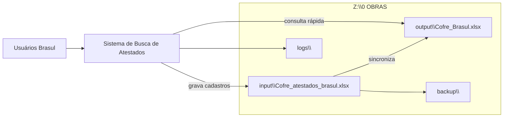

<div align="center">

# Sistema de Busca de Atestados

**Consulta e cadastro de códigos FDE · Brasul Construtora**

<br>


<br>

*Substitui o fluxo antigo de extração por OCR. A fonte oficial dos dados é a planilha **Cofre_atestados_brasul.xlsx**, mantida na rede e atualizada pela equipe.*

</div>

---

## Índice

- [Para que serve](#para-que-serve)
- [Principais recursos](#principais-recursos)
- [Como funciona](#como-funciona)
- [Estrutura na rede](#estrutura-na-rede)
- [Requisitos](#requisitos)
- [Instalação e primeiro uso](#instalação-e-primeiro-uso)
- [Uso do sistema](#uso-do-sistema)
- [Cadastro de atestados](#cadastro-de-atestados)
- [Build e release](#build-e-release)
- [Configuração avançada](#configuração-avançada)
- [Estrutura do projeto](#estrutura-do-projeto)
- [Boas práticas na rede](#boas-práticas-na-rede)

---

## Para que serve

O **Sistema de Busca de Atestados** centraliza o trabalho com códigos **FDE** dos atestados de obras da Brasul. A equipe consulta milhares de itens por **obra**, **código** ou **descrição**, filtra por tipo (**Acumulado** / **Quantitativa**) e registra novos atestados direto na planilha mestra — sem depender de PDFs ou OCR no dia a dia.

| Público | Uso |
|--------|-----|
| Engenharia / obras | Consultar códigos já cadastrados por obra |
| Cadastro | Incluir novos itens e códigos na base |
| Gestão | Acompanhar volume de itens e obras via KPIs na tela |

---

## Principais recursos

| Recurso | Descrição |
|---------|-----------|
| Busca inteligente | Filtro por texto, obra, tipo e histórico de pesquisas |
| Rede compartilhada | Dados em `Z:\0 OBRAS` — todos usam a mesma base |
| Tempo real | Atualização automática quando outro usuário altera a planilha (~2,5 s) |
| Cadastro manual | Novo atestado com validação de código, datas e unidade |
| Base de Referência | Criação de código novo quando não existe no catálogo |
| Backup automático | Cópia datada antes de cada gravação em `backup\` |
| Auditoria | Log de cadastros em `logs\cadastros.jsonl` |
| Exportação | Resultado da busca exportado para Excel |
| Instalador | `.exe` Windows + Inno Setup para distribuição interna |

---

## Como funciona



1. A planilha **Cofre_atestados_brasul.xlsx** é a fonte da verdade (aba *Atestados de Obras* + *Base de Referência*).
2. O sistema gera **Cofre_Brasul.xlsx** em `output\` para leitura rápida na interface.
3. Cadastros gravam na planilha mestra, fazem backup e atualizam a cópia de consulta.
4. Vários usuários na rede veem alterações sem reiniciar o programa.

---

## Estrutura na rede

```
Z:\0 OBRAS\
├── Sistema_de_atestado_brasul\     ← código-fonte / projeto
├── input\
│   └── Cofre_atestados_brasul.xlsx ← planilha principal (editar aqui)
├── output\
│   └── Cofre_Brasul.xlsx           ← cópia para busca na interface
├── backup\                         ← backups automáticos
└── logs\
    ├── cadastros.jsonl             ← auditoria de cadastros
    └── historico_busca.json        ← últimas buscas
```

> O nome antigo `Base_Mestra_FDE.xlsx` é reconhecido e migrado automaticamente na primeira abertura.

---

## Requisitos

- **Windows 10/11**
- **Python 3.10+** (desenvolvimento)
- Unidade **Z:** mapeada com acesso a `Z:\0 OBRAS`
- **Microsoft Excel** instalado (para edição manual da planilha, se necessário)
- Dependências: `requirements.txt`

---

## Instalação e primeiro uso

### 1. Clonar / copiar o projeto

```powershell
# Exemplo: projeto na rede
cd "Z:\0 OBRAS\Sistema_de_atestado_brasul"
```

### 2. Ambiente Python (desenvolvimento)

```powershell
python -m venv .venv
.\.venv\Scripts\activate
pip install -r requirements.txt
```

### 3. Preparar pastas na rede

```powershell
.\scripts\init_rede.ps1
```

Coloque a planilha em:

`Z:\0 OBRAS\input\Cofre_atestados_brasul.xlsx`

### 4. Executar

```powershell
python src\interface.py
```

Ou use o executável gerado em `dist\Cofre_Brasul.exe`.

---

## Uso do sistema

| Ação | Como fazer |
|------|------------|
| Buscar | Digite código, descrição ou termo; use filtros **Acumulado** / **Quantitativa** |
| Filtrar obra | Botão de seleção de obra (lista com busca) |
| Recarregar | **↺ RECARREGAR DADOS** — força sync da planilha mestra |
| Exportar | **⬆ EXPORTAR BUSCA** — salva o resultado filtrado em `.xlsx` |
| Limpar filtros | Tecla `Esc` |

Os KPIs na barra lateral mostram totais de **obras**, **itens**, **acumulado** e **quantitativa**.

---

## Cadastro de atestados

1. Clique em **NOVO ATESTADO**.
2. Preencha obra, arquivo PDF (nome de referência), datas e tipo.
3. Informe o **código FDE** — descrição e UN vêm da Base de Referência.
4. Se o código não existir: **Criar na Base de Referência** ou **Tentar novamente**.
5. **Salvar** grava na planilha mestra (com backup prévio).

**Regras:** datas no formato `DD/MM/AAAA`; TRP não pode ser anterior à data de início; campos de texto em **MAIÚSCULAS**; não deixe a planilha aberta no Excel durante o salvamento.

---

## Build e release (`current` na rede)

Padrão igual **Auditoria** e **Pedidos**: cada atualização vai para `current\`; o usuário **fecha e abre** o atalho.

1. Atualize `config\version.py` se quiser mudar o número da versão.
2. Rode na pasta do projeto:

```powershell
.\ATUALIZAR_ATESTADO.bat
# ou
powershell -ExecutionPolicy Bypass -File tools\build_release.ps1
```

3. O script gera:
   - `releases\Cofre_Brasul_v2.2.0_AAAAMMDD_HHMM\` — histórico
   - `current\` — **versão que todos usam**

### Atalho para os usuários

| Item | Caminho |
|------|---------|
| Executável | `Z:\0 OBRAS\Sistema_de_atestado_brasul\current\Cofre_Brasul.exe` |
| Launcher | `Brasul-BuscaAtestados.bat` |

### Instalador opcional (PC sem atalho na rede)

```powershell
.\scripts\build.ps1 -Installer
```

---

## Configuração avançada

| Variável / arquivo | Função |
|--------------------|--------|
| `deploy\rede.path` | Pasta de dados na rede (padrão: `Z:\0 OBRAS`) |
| `COFRE_BRASUL_DATA` | Sobrescreve a pasta de dados (variável de ambiente) |
| `COFRE_BRASUL_RELEASE` | Destino do script `release.ps1` |
| `config\settings.py` | Caminhos, colunas, intervalo do monitor em tempo real |
| `config\version.py` | Nome e versão exibidos na interface |

**Sincronização manual (CLI):**

```powershell
python src\main.py
```

---

## Estrutura do projeto

```
Sistema_de_atestado_brasul/
├── assets/              # ícone e logotipo Brasul
├── config/              # settings.py, version.py
├── deploy/              # rede.path (não versionar caminho real)
├── scripts/             # build.ps1, release.ps1, init_rede.ps1
├── src/
│   ├── interface.py     # aplicação principal
│   ├── main.py          # sync planilha → cofre (CLI)
│   ├── base_loader.py   # leitura Excel e sync
│   ├── services/        # gravação atestados e referência
│   ├── ui/              # telas, tema, branding
│   └── utils/           # busca, datas, backup, vigia rede
├── Cofre_Brasul.spec    # PyInstaller
├── instaler.iss         # Inno Setup
└── requirements.txt
```

---

## Boas práticas na rede

- Mantenha **uma planilha mestra** em `input\` — evite cópias paralelas com nomes diferentes.
- **Feche o Excel** antes de cadastrar pelo sistema.
- Prefira cadastrar pelo programa (backup e log automáticos).
- Em dúvida, use **RECARREGAR DADOS** após edição manual na planilha.
- Backups antigos em `backup\` podem ser arquivados periodicamente pela TI.

---

<div align="center">

**Brasul Construtora LTDA** · Uso interno

*Sistema de Busca de Atestados v2.2.0*

</div>
